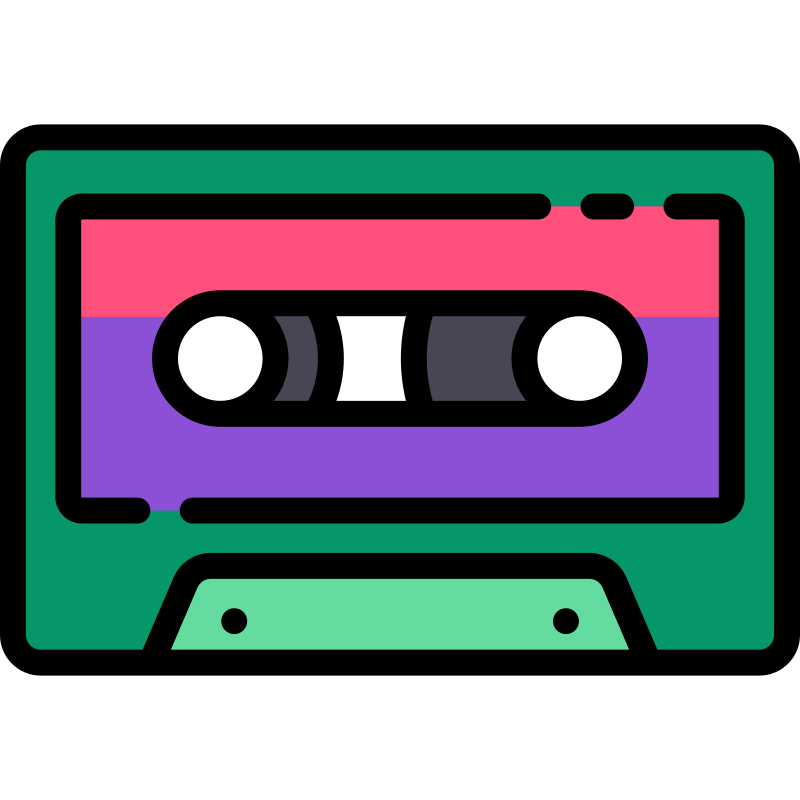

# Cassette

Cassette is a simple to host web session recorder and player.



### Quick Start

Run using Docker:

```bash
docker run -it --rm -p 3000:3000 ghcr.io/adrianliechti/cassette
```

Page Integration

```html
<html>
  <head>
    <script src="http://localhost:3000/cassette.min.cjs"></script>
  </head>
<html>
```

Open [http://localhost:3000](http://localhost:3000)


### Acknowledgements

 - [Christian Rutzer](https://github.com/chrutzer)
 - [rrweb](https://github.com/rrweb-io/rrweb)